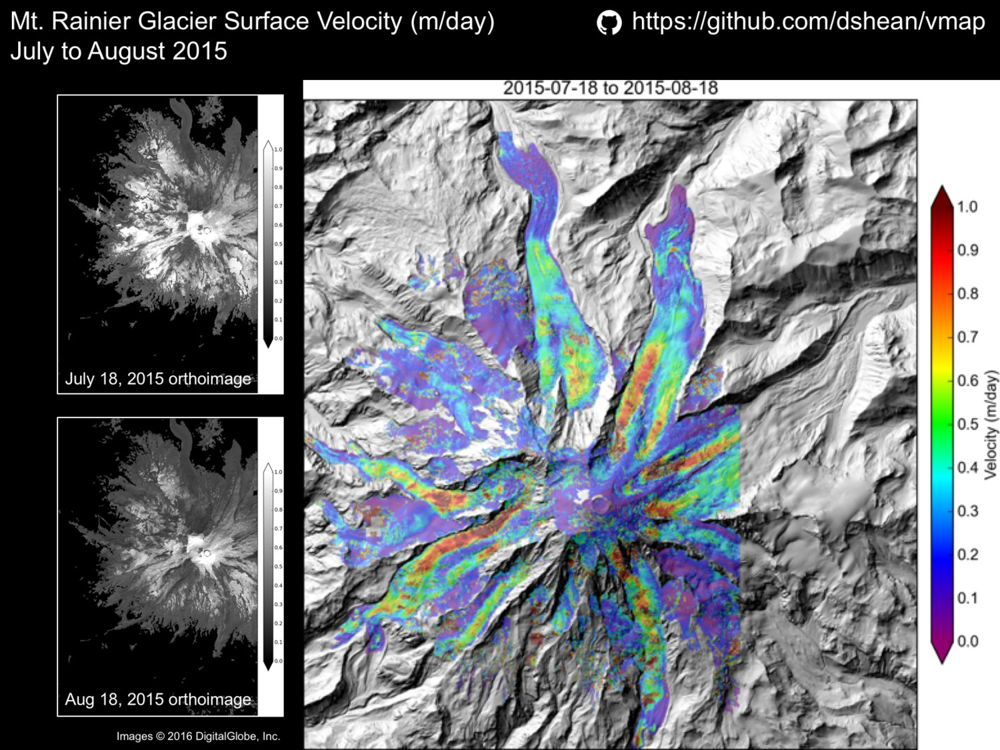

# vmap 

Velocity map generation using the NASA Ames Stereo Pipeline (ASP) image correlator

## Overview

The [ASP/VW](https://ti.arc.nasa.gov/tech/asr/intelligent-robotics/ngt/stereo/) correlator is fast, memory-efficient, multi-threaded, and _generalized_.  This means it can be used for efficient feature tracking operations on two arbitrary input rasters acquired at different times. 

### Example

### Command-line examples (run with no arguments for usage)

Generate a velocity map from two orthorectified images (or any raster in projected coord sys, e.g. high-res DEM shaded relief maps with identical illumination):
- `vmap.py img1_YYYYMMDD.tif img2_YYYYMMDD.tif` 
- Generates ASP disparity maps (`'-RD.tif'`, `'-F.tif'`, `'-F_smooth.tif'`)
- By default, calls `disp2v.py` on `'-F.tif'` to generate output velocity products
- Correlator options are currently hardcoded - can edit directly in main(), but eventually will be accepted as command-line arguments

Convert output ASP disparity map to m/yr or m/day:
- `disp2v.py img1_YYYYMMDD__img2_YYYYMMDD_vmap/img1_YYYYMMDD__img2_YYYYMMDD_vmap-F.tif`
- Output: `'_vm.tif'` (velocity magnitude in m/yr or m/day), `'_vx.tif'` (horizontal velocity component), `'_vy.tif'` (vertical velocity component)

Preview subsampled version of disparity map:
- `disp_view.sh img1_YYYYMMDD__img2_YYYYMMDD_vmap/img1_YYYYMMDD__img2_YYYYMMDD_vmap-F.tif`
- Creates `'-F_b1_5.tif'` and `'-F_b2_5.tif'` and opens linked view with [`imview.py`](https://github.com/dshean/imview)

Sorry about the long filenames.  

## Installation

Install the latest release from PyPI:

    pip install vmap 

**Note**: by default, this will deploy executable scripts in /usr/local/bin

### Building from source

Clone the repository and install:

    git clone https://github.com/dshean/vmap.git
    pip install -e vmap/

The -e flag ("editable mode", setuptools "develop mode") will allow you to modify source code and immediately see changes.

### Core requirements 
- [NASA Ames Stereo Pipeline (ASP)](https://ti.arc.nasa.gov/tech/asr/intelligent-robotics/ngt/stereo/)
- [GDAL/OGR](http://www.gdal.org/)
- [NumPy](http://www.numpy.org/)
- [pygeotools](https://github.com/dshean/pygeotools)

### Optional requirements (needed for some functionality) 
- [imview](https://github.com/dshean/imview)
- [demcoreg](https://github.com/dshean/demcoreg) (offset correction over bare ground surfaces)
- [matplotlib](http://matplotlib.org/)
- [SciPy](https://www.scipy.org/)

## License

This project is licensed under the terms of the MIT License.
